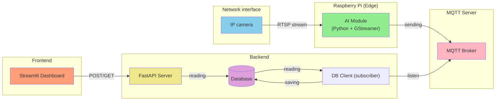

# System for Traffic Monitoring and Analysis using Computer Vision (Bachelor_thesis)
This repository contains the source code and documentation for my Bachelor's thesis project: an automated system designed for real-time traffic monitoring and analysis. By leveraging Computer Vision and Edge Computing, the system detects, tracks, and analyzes vehicular flow to provide actionable insights for urban planning and traffic management.

The architecture is built to handle the full data pipeline - from capturing raw RTSP video streams at the edge to processing and visualizing data on a central dashboard.

**Detection from pipeline:**

### System architecture diagram (with data flow)

