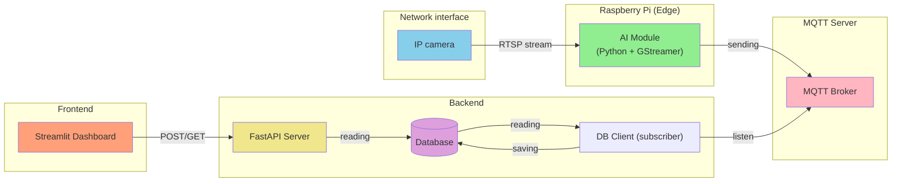

# Traffic Monitoring and Analysis System
**Automated real-time traffic analysis using Computer Vision and Edge Computing.**

This repository contains the source code for my Bachelor's thesis. The system handles the entire data pipeline—from raw RTSP streams at the edge to a centralized dashboard for urban planning insights.

### Key features
- **Real-time Detection & Tracking:** Leverages Computer Vision to identify and follow vehicles in video streams.
- **Edge Processing:** Optimized to run on Raspberry Pi using GStreamer and Python.
- **Data Pipeline:** Reliable data transfer from Edge devices to a central server via MQTT.
- **Interactive Dashboard:** Visualize traffic flow, peak hours, and vehicle counts in real-time.

### System Architecture
The system is divided into an Edge processing unit (AI Module) and a central management layer.

```mermaid
graph LR
    subgraph "Raspberry Pi (Edge)"
        AI["AI Module</br> (Python + GStreamer)"]
    end
    
    subgraph "Network interface"
        Camera["IP camera"]
    end
    
    subgraph "MQTT Server"
        MQTT[MQTT Broker]
    end

    subgraph "Backend"
        DB[(Database)]
        DBListener["DB Client (subscriber)"]
        FastAPI[FastAPI Server]
    end

    subgraph "Frontend"
        Streamlit[Streamlit Dashboard]
    end
    
    Camera -->|RTSP stream| AI
    AI -->|sending| MQTT
    DBListener --> |listen| MQTT
    DBListener -->|saving| DB
    DB -->|reading| DBListener
    FastAPI -->|reading| DB
    Streamlit -->|POST/GET| FastAPI
    
    style AI fill:#90EE90
    style Camera fill:#87CEEB
    style MQTT fill:#FFB6C1
    style DB fill:#DDA0DD
    style FastAPI fill:#F0E68C
    style Streamlit fill:#FFA07A
```

### Visuals
**Detection Pipeline:**

**Analytics Dashboard:**

### Tech Stack
- **Edge Hardware:** Raspberry Pi
- **Language:** Python
- **Vision:** GStreamer
- **Communication:** MQTT
- **Database:** PostgreSQL
- **BackEnd:** FastApi
- **Visualization:** Streamlit
